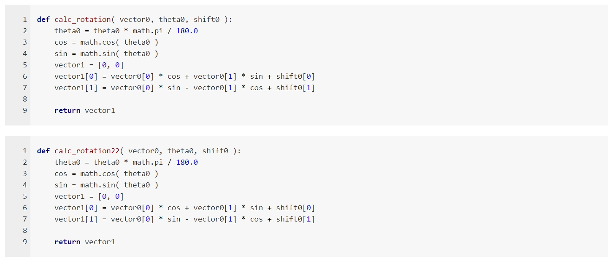

### Custom omnimarkuppreviewer - a template

---

- **Environment:** sublime text 3 + omnimarkuppreviewer
- **Modify:**
    + based on github style template
    + change font to "Times New Roman"
    + modify the code appearence style in code blocks to python style
    + add lineno to code blocks

#### How to do

- Find the root of omnimarkuppreviewer:
    + sublime Text 3 --> Preferences --> Browse Packages.
    + In OmniMarkupPreviewer, two folders exists: public and templates.
- in public, copy app.js to app-custom0.js and github.css to github-custom0.css.
- In templates, copy github.tpl to github-custom0.tpl.
- Find settings of omnimarkuppreviewer in sublime Text 3:
    + Preferences --> Package Settings --> omnimarkuppreviewer --> Settings User.
- Add the setting below into it. Do this before modify the files copied above for the purpose of debugging : ) .
```json
{
    "html_template_name": "github-custom0",
}
```
- Then modify the tpl file to include the css and js files
- Modify the css file:
    + Change font to "Times New Roman".
    + Change styles of codes.
- Modify the js file:
    + Add divs with spans before every code block to show the lineno of the code.
    + Adjust styles.

#### How to use

- Just copy them to the corresponding path, and add a line of setting shown above into the omnimarkuppreviewer settings.

Here are some code for test:

```python
def calc_rotation( vector0, theta0, shift0 ):
    theta0 = theta0 * math.pi / 180.0
    cos = math.cos( theta0 )
    sin = math.sin( theta0 )
    vector1 = [0, 0]
    vector1[0] = vector0[0] * cos + vector0[1] * sin + shift0[0]
    vector1[1] = vector0[0] * sin - vector0[1] * cos + shift0[1]

    return vector1
```

```python
def calc_rotation22( vector0, theta0, shift0 ):
    theta0 = theta0 * math.pi / 180.0
    cos = math.cos( theta0 )
    sin = math.sin( theta0 )
    vector1 = [0, 0]
    vector1[0] = vector0[0] * cos + vector0[1] * sin + shift0[0]
    vector1[1] = vector0[0] * sin - vector0[1] * cos + shift0[1]

    return vector1
```

Shown in my browser:



Have fun : ) .
